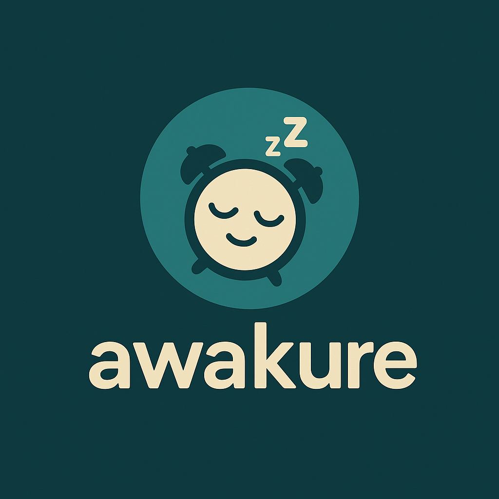

Below is a comprehensive **README.md** you can include at your project root. It covers your personal motivation, the psychological principle behind the app, all the technologies you’ve used, a summary of features, folder structure, and build/run instructions.

Feel free to tweak any sections to better match your voice or add screenshots and badges as you see fit.

---

```markdown
# Awakure – A Smarter, Hard‑to‑Ignore Morning Alarm  



## 🚀 Motivation & Problem Statement

> **“Why is it so easy to hit snooze—day after day—when the world needs us to wake up on time?”**

For years, I—and my family—struggled with the **snooze trap**. No matter how early we set our alarms, we’d drift back to sleep rather than start our day. Yet, when there’s a truly “big event” (a flight, an exam, meeting someone important), we spring awake without a second thought.  

I discovered that two forces wake us reliably:
1. **Immediate mental engagement** (a puzzle, a challenge)  
2. **Intrinsic motivation** (something we truly care about)

**Awakure** combines both by:
- Pushing your brain to solve a quick problem (math, pattern, or custom “wake‑task”)  
- Announcing your day’s **to‑do list** via Text‑to‑Speech  

This leverages **cognitive arousal** and **purpose‑driven motivation** to break the snooze habit.

---

## 🧠 Psychology of Waking Up

1. **Cognitive Activation**: Simple math or pattern recognition wakes prefrontal cortex, halting the sleep inertia loop.  
2. **Purpose Anchoring**: Hearing your own tasks reminds you of real‑world stakes.  
3. **Habit Disruption**: By removing the autopilot of snooze, you build a new ritual of waking with intention.

---

## 🌐 Technology Stack

| Layer                   | Technology                                                                 |
|-------------------------|----------------------------------------------------------------------------|
| **Core Logic**          | C++17                                                                      |
| **GUI**                 | Qt6 Widgets + Qt Quick (future)                                             |
| **Audio & Multimedia**  | Qt6 Multimedia (QSoundEffect/QMediaPlayer)                                  |
| **Text‑to‑Speech**      | Qt6 TextToSpeech                                                           |
| **Task & Alarm Storage**| JSON files / QSettings                                                     |
| **Python Scripting**    | Spotipy (Spotify API) + Flask (optional web callback)                      |
| **Build System**        | CMake + vcpkg                                                              |
| **Version Control**     | Git                                                                        |

---

## 🌟 Key Features

1. **Multiple Alarms**  
   - Set and name multiple alarms  
   - Daily, weekdays, weekends, or one‑off  
2. **Wake‑Challenge**  
   - Solve a quick math puzzle to dismiss  
3. **To‑Do Announcement**  
   - Enter your morning tasks  
   - First alarm triggers a spoken list via `QTextToSpeech`  
4. **Persistent Storage**  
   - Alarms and tasks saved in JSON for next launch  
5. **Custom Sound & Icon**  
   - Embeds your own MP3/WAV ringtone  
   - App icon and UI font bundled in Qt Resource File (`.qrc`)  
6. **Modern GUI**  
   - Dark theme, custom font (Lexend)  
   - Bottom navigation for “Alarm” vs “To‑Do”  

---

## 📁 Folder Structure

```

alarm-engine/
├── assets/
│   ├── icons/
│   │   └── awakure\_icon.png
│   └── fonts/
│       └── Lexend-VariableFont\_wght.ttf
├── src/
│   ├── main.cpp
│   ├── alarms/
│   │   ├── AlarmManager.hpp/.cpp
│   ├── todo/
│   │   ├── Todolist.hpp/.cpp
│   └── gui/
│       ├── MainWindow\.ui
│       ├── MainWindow\.hpp/.cpp
│       └── resources.qrc
├── CMakeLists.txt
├── README.md
└── build/ (out‑of‑source build)

````

---

## 🛠️ Build & Run

### Prerequisites

1. **Install Qt6** via **vcpkg**:
   ```bash
   git clone https://github.com/Microsoft/vcpkg.git
   cd vcpkg
   .\bootstrap-vcpkg.bat
   .\vcpkg integrate install
   .\vcpkg install qt6:x64-windows
````

2. **Clone this repo** and create a build folder:

   ```bash
   git clone https://github.com/yourusername/awakure.git
   cd awakure
   mkdir build && cd build
   ```
3. **Configure & build**:

   ```bash
   cmake .. -DCMAKE_TOOLCHAIN_FILE=C:/vcpkg/scripts/buildsystems/vcpkg.cmake -DCMAKE_BUILD_TYPE=Release
   cmake --build .
   ```

### Run

```bash
./awakure.exe
```

---

## 🧩 How It Works

1. **Alarm Tab**:

   * Tap “Add Alarm” → pick time + label + repeat.
   * Alarms saved in JSON and listed with enable toggles.

2. **To‑Do Tab**:

   * Tap “Add Task” → enter your morning to‑dos.
   * Tasks stored persistently.

3. **Morning Routine**:

   * At the first active alarm of the day, `QTextToSpeech` reads out your tasks.
   * To dismiss the alarm, solve a simple math puzzle—activating your brain instantly.

---

## 🚀 Extensions & Roadmap

* **Recurring schedules**: Weekly rhythms, custom date ranges
* **Smart analytics**: Track wake‑up success rate, habit streaks
* **Mobile ports**: Android/iOS via Qt Mobile or Flutter bridge
* **Voice recognition**: Say “stop” to dismiss (using speech‑to‑text)

---

## 📓 License & Acknowledgements

* **Awakure** is © 2025 by \[Gajendra Singh Rana]. All rights reserved.
* Icons and fonts licensed under their respective open licenses.
* Built with ❤️ using Qt and modern C++.

---

Thank you for exploring **Awakure**—the alarm that **wakes your mind** and **fuels your purpose**. Feel free to contribute, file issues, and suggest features!

```

---

Feel free to adjust any descriptions, paths, or examples to match your exact implementation. This README not only shows **how to build and run** but also **why** you built it and **how** each technology contributes to solving the snooze problem.
```
