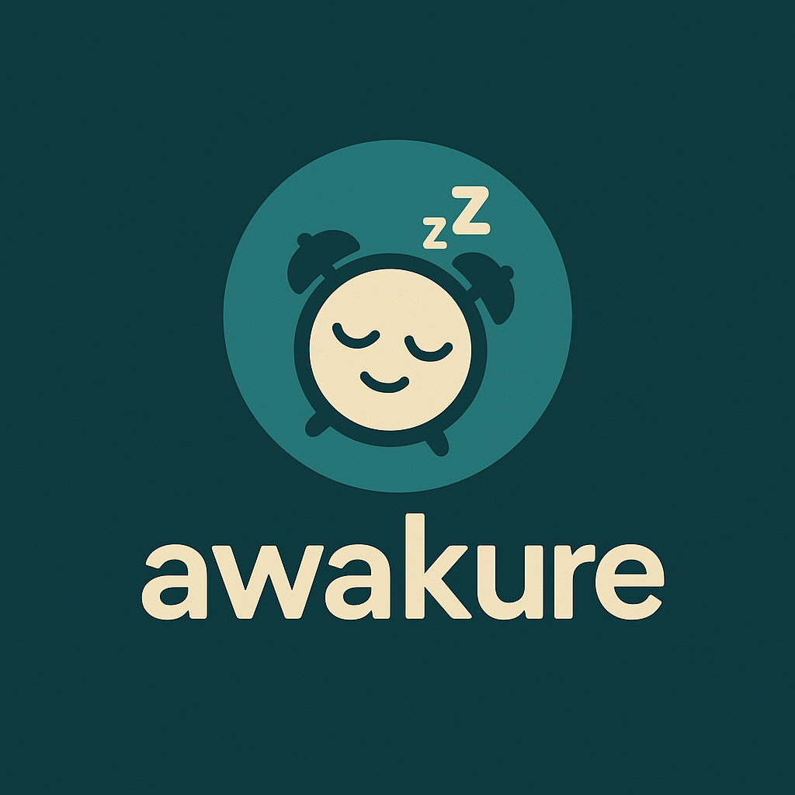

# Awakure – A Smarter, Hard‑to‑Ignore Morning Alarm



Awakure helps you wake up with intention by combining a quick cognitive nudge and a spoken rundown of your morning to‑dos.

### What changed recently
- The UI is now built with HTML/CSS/JavaScript and embedded inside the desktop app via Qt WebEngine.
- JS ↔ C++ communication uses Qt WebChannel through a small C++ bridge (`src/gui/Bridge.*`).
- The build supports both Qt 6 and Qt 5 (5.15+) depending on what you have installed.
- A standalone browser preview is available at `test/preview.html`.

## Technology Stack
- Core: C++17
- Desktop host: Qt Widgets
- Embedded web UI: HTML/CSS/JavaScript via Qt WebEngine
- JS↔C++ bridge: Qt WebChannel
- Audio/Text‑to‑Speech: Qt Multimedia, Qt TextToSpeech
- Build: CMake 3.16+, MSVC/Clang/GCC, Ninja (optional)
- Dependency manager (optional): vcpkg

## Features
- Multiple alarms with hour:minute and label
- Daily re‑scheduling of alarms
- To‑do list with add/remove
- Text‑to‑Speech reads your tasks when an alarm fires or on demand
- Modern web UI embedded in a native window

Note: The earlier “wake‑challenge” puzzle is planned and not active in the current build.

## Folder Structure
```
alarm-engine/
├── assets/
│   ├── icons/
│   ├── fonts/
│   └── web/            # HTML/CSS/JS used by the embedded web view
├── src/
│   ├── main.cpp
│   ├── gui/
│   │   ├── MainWindow.hpp/.cpp
│   │   ├── Bridge.hpp/.cpp
│   │   └── resources.qrc
│   ├── todo/           # Simple C++ models for tasks
│   └── Alarm*.{hpp,cpp}
├── test/               # Standalone browser preview (preview.html)
├── CMakeLists.txt
└── build/              # Out‑of‑source build
```

## Build & Run (Windows)
Prerequisites:
- CMake 3.16+
- C++ compiler (Visual Studio 2019/2022 or Build Tools)
- Qt 6.x or Qt 5.15+ with modules: Widgets, Multimedia, TextToSpeech, WebEngineWidgets, WebChannel
- Optional: Ninja, vcpkg

Configure (pick one):
1) System Qt (provide your Qt CMake prefix path):
```powershell
cmake -S . -B build -G "Ninja" -DCMAKE_PREFIX_PATH="C:/Qt/6.6.0/msvc2019_64"
```
2) vcpkg:
```powershell
cmake -S . -B build -G "Ninja" -DCMAKE_TOOLCHAIN_FILE="C:/vcpkg/scripts/buildsystems/vcpkg.cmake" -DVCPKG_TARGET_TRIPLET=x64-windows
```

Build:
```powershell
cmake --build build --config Release
```

Run:
```powershell
build/Release/alarm-engine.exe
```

## Web UI Preview (no C++ required)
Open `test/preview.html` in a modern browser to try the UI and speech preview (uses Web Speech API). This is a mock preview that stores state in `localStorage`.

## How It Works
- `MainWindow` hosts a `QWebEngineView` and loads `qrc:/web/index.html` from the Qt resource file.
- A `QWebChannel` exposes a `Bridge` object to JavaScript as `bridge`.
- The bridge manages in‑memory alarms and tasks, schedules `QTimer`s for alarms, emits updates to the UI, and invokes `QTextToSpeech` to read tasks.

## Roadmap
- Wake‑challenge mini‑puzzle before dismissing an alarm
- Persistent storage (JSON/QSettings)
- Mobile ports via Qt for Android/iOS

## License & Credits
© 2025 Gajendra Singh Rana. Icons and fonts are under their respective licenses. Built with Qt and modern C++.
